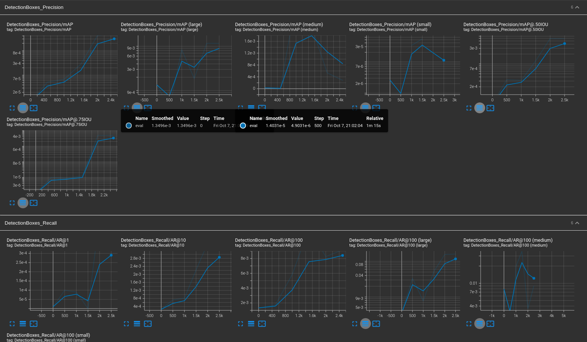
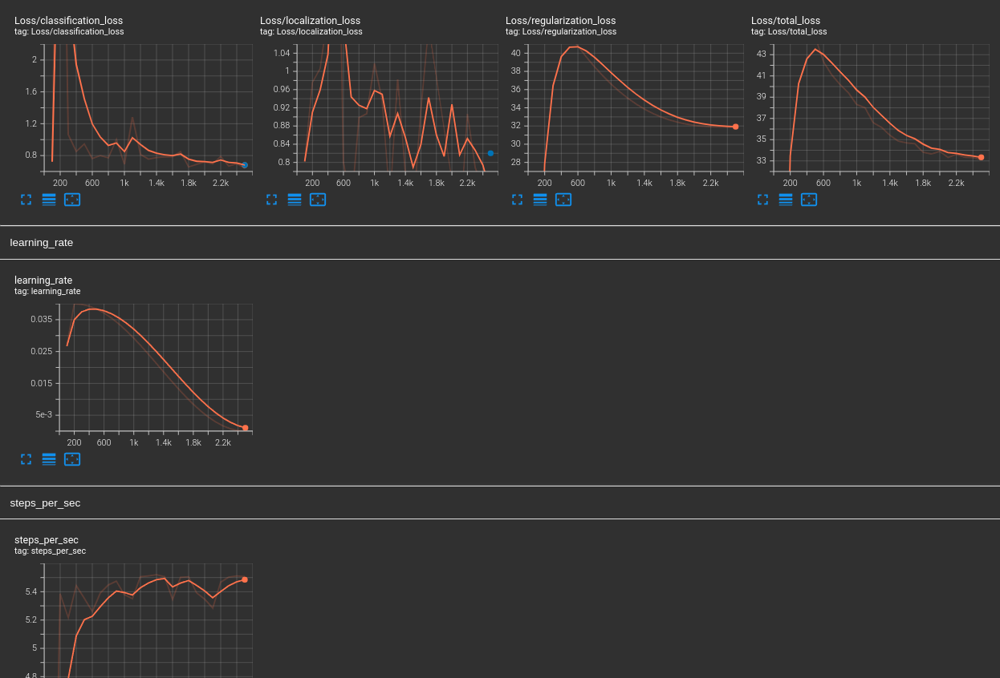
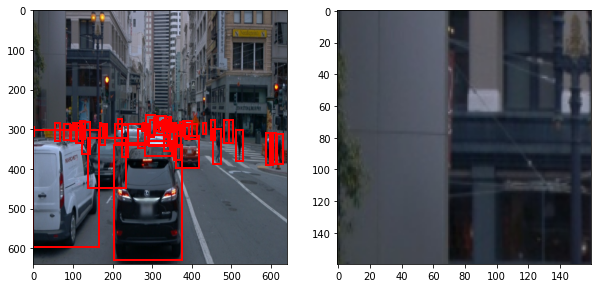
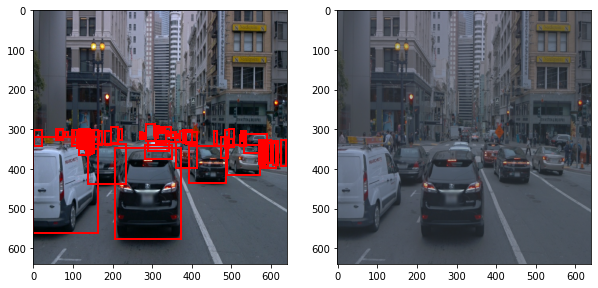
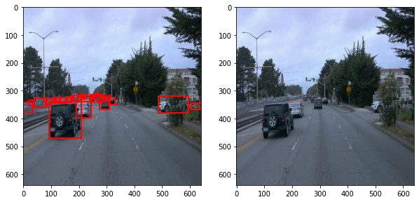
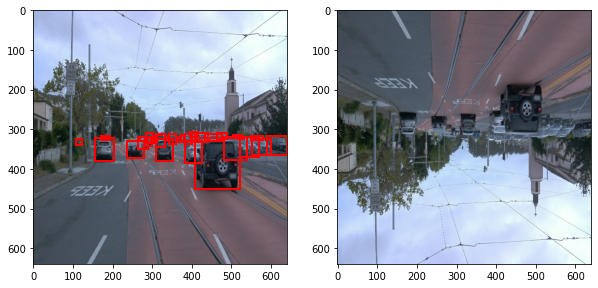
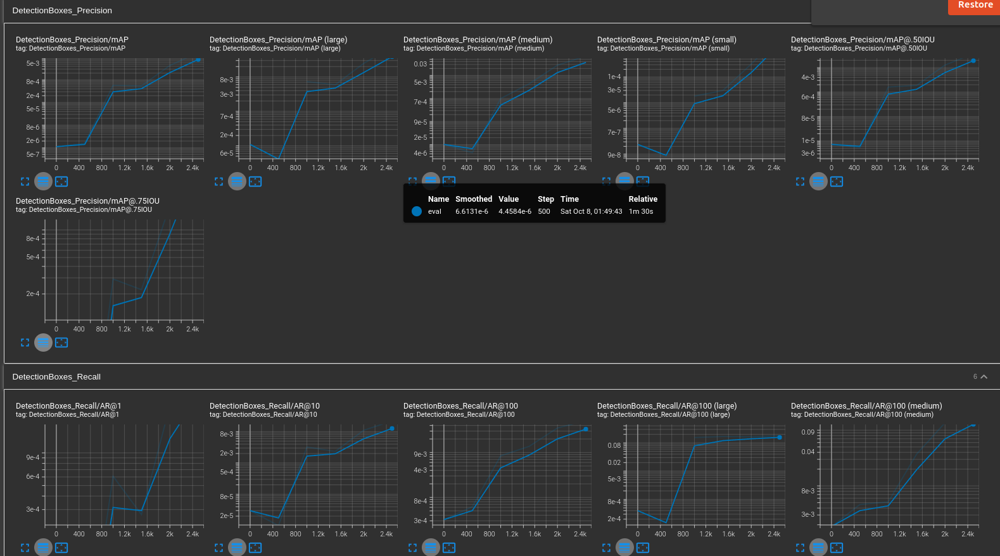
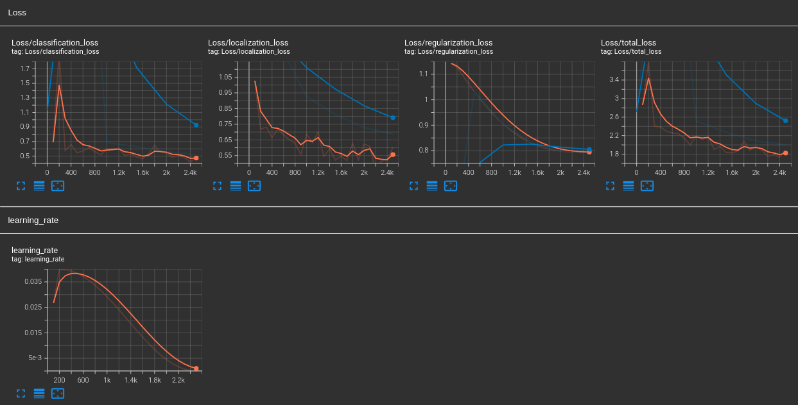

# Object Detection in an Urban Environment

## Project overview: 
Self-driving cars needs to navigate in roads without colliding with other road users, such as vehicles, pedestrians and cyclists. Identifying them seperately allows applying different road user behavihorial models. e.g. vehicle has a larger footprint and usually follows the direction of roads, while pedestrian has relatively smaller footprint but direction of movement is more dynamic. Therefore recognizing other road users is a very critical capability for Self-driving vehicles to be successful in reality. In this project, road user detection is trained using Convolution Neural Networks with Waymo Open dataset. Firstly with a reference implementation, and then some algoirthm performance improvements are experiemented.

## Set up: 

For this project, [Waymo Open dataset](https://waymo.com/open/) will be used.

"Object Detection in an Urban Environment" project environment can be setup by following step 2) Setup instructions and step 5) Project instructions (Local). Key commands used are listed below. 

Firstly, follow the README.md in "docker setup" directory to create a docker container. 

    Please note in the original Udacity supplied docker image, some python libraries were broken, then I fixed them in the image, and saved as a new container to reload in the consecutive experiments. 

    Reference: https://knowledge.udacity.com/questions/861779

Running the docker image

    sudo docker run --gpus all -v <host source directory>:/app/project/ --network=host -ti <docker image name> bash

List running docker image names

    sudo docker ps

Start another terminal window attached to the same docker runtime
    sudo docker exec -it <docker id> /bin/bash

Train the model using reference implementation

    python experiments/model_main_tf2.py --model_dir=experiments/reference/ --pipeline_config_path=experiments/reference/pipeline_new.config

Evaluate the model using reference implementation

    python experiments/model_main_tf2.py --model_dir=experiments/reference/ --pipeline_config_path=experiments/reference/pipeline_new.config --checkpoint_dir=experiments/reference/

    Note: By default, script evaluates only for the last checkpoint. Therefore to have the evaluation for all checkpoints in file /reference/checkpoint following line should be sequentially changed to each checkpoint, and run the evaluation for each time. Then the tensorboard graphs will be updated correctly for all the checkpoints.

    model_checkpoint_path: "ckpt-6" 

Open the tensorboard to visualize the tensor graphs for the reference implementation

    python -m tensorboard.main --logdir experiments/reference/.

Launch Jupyter notebook

    jupyter notebook --port 3002 --ip=0.0.0.0 --allow-root

## Dataset
### Dataset Analysis: 
Data Analysis jupyter notebook covered analyzing the dataset qualitively and quantitavely. One obvious observation when visualizing the multiple of 10 randoms images out of the dataset was, there are many annoted images for vehicles (red), then pedestrians (green) lower than vehicles (blue), and cyclists very rarely appearing, actually only in a few images. To verify this quantitatively, counting of each object class was performed across the whole dataset. 

    Number of records:  86
    Number of bounding boxes:  1657
    Number of vehicles:  1307
    Number of pedestrians:  343
    Number of cyclists:  7

    Number of records:  86
    Number of bounding boxes:  1974
    Number of vehicles:  1526
    Number of pedestrians:  436
    Number of cyclists:  12

Also, while inspecting the dataset it was observed some of the images are severly affected by darker light and weather conditions. In those instances, it is very difficult to identy each objects even by a human. Also, noted some of the bounding boxes for the objects are either occluding with other classes of objects or bounding box size is relatively very small, causing it to detect by human. It is good to have this realistic variation in the dataset, so in real setups, trained models could perform reasonably. 

### Cross-validation: 
Main technique to cross validate the model training was split the dataset into training and validation sets. Training dataset is used to train the CNN model, and validation set is used to validate the trained model. 

There were 99 valid images, and the dataset was splitted as below.

    Training set - 86 images
    Validation set - 10 images
    Test set - 3 images

  Validation set size is about 10/96 = 10.4 % of out of the training + validation dataset. Emperically, 10 to 20% of the dataset being the validation dataset is considered a balanced split.  

## Training
### Reference experiment: 
    mAP for all precision and recall measurements were close to 0, indicating the accuracy of the training is not sufficient.

    classfication loss (greater than 0.6), localization loss (greater than 0.8), regularlization loss, (greater than 32.0) and total loss  (greater than 33.0) were too high, indicating the trained model was not accurate in classifying the training data. Possibly, it can be expected with the not optimized pipeline parameters and relatively smaller dataset.

### Improve on the reference:   
Augmentation
    
    Augmentation is all about diversitying the dataset, and have more training input data for improving the trained model, and ultimately improve the model accuracy. 

    All the additional augmentation techniques were visualized in Explore augmentations.ipynb (please have a look). Below is a short note on applied augmention. 

Random crop augmentation
    
    Left image - original image, right - randomly cropped image

    The RandomCrop transform (see also crop()) crops an image at a random location.

    usage:

    data_augmentation_options {
        random_crop_image {
        min_object_covered: 0.0
        min_aspect_ratio: 0.75
        max_aspect_ratio: 3.0
        min_area: 0.75
        max_area: 1.0
        overlap_thresh: 0.0
        }
    }
    
Random contrast adjustment
    
    Left image - original image, right - randomly contrast altered image

    Randomly adjusts the contrast of an image 

    usage:

    data_augmentation_options { random_adjust_contrast { min_delta: 0.6 max_delta: 1.0 } }

Random brightness adjustment

    Left image - original image, right - randomly brightness altered image

    Randomly adjusts the brightness of an image

    usage:

    data_augmentation_options { random_adjust_brightness { max_delta: 0.2 } }

Random horizontal flip

    Left image - original image, right - randomly flipped horizontally image

    The RandomHorizontalFlip transform (see also hflip()) performs horizontal flip of an image, with a given probability.

    usage:

    data_augmentation_options {
        random_horizontal_flip {
        }
    }

Pipeline configuration files

    under experiments/experiment0 directory following configuration files were created for different combinations of augmentations.

    pipeline_new.config - File with all proposed augmentations
    pipeline_new_1.config - Random horizontal flip
    pipeline_new_2.config - Random crop image 
    pipeline_new_3.config - Random contrast adjustment pipeline_new_4.config - Random RGB to gray 
    pipeline_new_5.config - Random brightnesss adjustment

    Even with the improvement made with augmentation mAP for all precision and recall measurements were close to 0, indicating the accuracy of the training is not sufficient or something possibly wrong with how mAP is calculated.

    classfication loss (less than 0.5), localization loss (less than 0.6), regularlization loss (less than 0.8), and total loss  (less than 1.9) were significantly lower loss than that of the reference experiment, indicating the trained model has improved with the augmentation techniques attempted.

Video of the inference results

    
    It was observed in the attempted set of files, vehicles (green boudning boxes)were detected reasonably accurate. But, neighther passengers (there were several passengers appeared) nor cyclists (only few had the cyclists) were detected.

